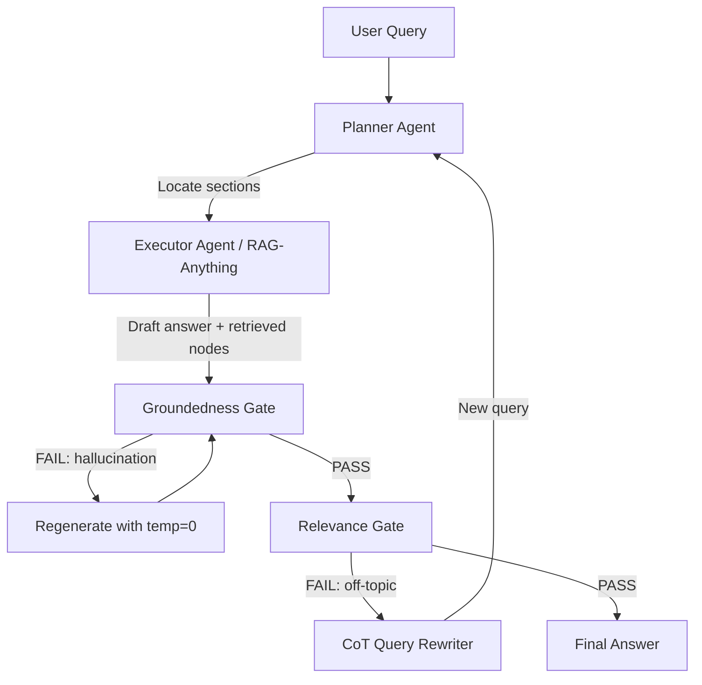

# Agentic RAG Architecture - Wrapping RAG-Anything with LangGraph

## Background

RAG-Anything hiện hoạt động theo luồng **one-shot retrieval**: nhận câu hỏi → truy xuất → trả lời. Nếu truy xuất sai, không có cơ chế tự sửa. Dự án này bọc RAG-Anything bằng kiến trúc **Agentic phân tầng** do LangGraph điều phối, gồm:

1. **Self-Correcting RAG** - Vòng lặp phản biện với 2 cổng kiểm duyệt (Groundedness + Relevance)
2. **Locate-then-Read** - Planner Agent quét cấu trúc phân cấp đồ thị để khoanh vùng trước khi trích xuất sâu

## Proposed Changes

### Architecture Overview



---

### Project Structure

```
RAG_upgrade/
├── .env                          # API keys (symlink or copy from RAG_base)
├── requirements.txt              # langgraph, langchain-core, openai, pydantic, etc.
├── config.py                     # Centralized config (thresholds, model names, max retries)
├── llm_client.py                 # Async OpenAI-compatible LLM client
├── rag_bridge.py                 # Bridge to RAG_base's RAGService + graph data access
├── agents/
│   ├── __init__.py
│   ├── planner.py                # Locate-then-Read: scan graph hierarchy → locate relevant sections
│   ├── executor.py               # Deep-read: call RAG-Anything aquery on located sections
│   ├── grader_groundedness.py    # Groundedness Gate: cross-ref answer vs context
│   ├── grader_relevance.py       # Relevance Gate: does answer address the question?
│   └── query_rewriter.py         # CoT Query Rewriting khi Relevance Gate fail
├── graph/
│   ├── __init__.py
│   ├── state.py                  # TypedDict state schema for LangGraph
│   └── agentic_rag_graph.py      # StateGraph wiring tất cả agents
├── api_server.py                 # FastAPI endpoint wrapping pipeline
└── tests/
    ├── __init__.py
    ├── test_graders.py           # Unit tests cho graders (mock LLM)
    └── test_pipeline.py          # Integration test end-to-end
```

---

### Core Infrastructure

#### [NEW] [config.py](file:///home/lamquy/Project/RAG/RAG_upgrade/config.py)

Centralized configuration:
- `LLM_MODEL`: model name (default `gpt-4o-mini`)
- `LLM_API_KEY`, `LLM_BASE_URL`: từ [.env](file:///home/lamquy/Project/RAG/RAG_base/.env)
- `GROUNDEDNESS_THRESHOLD`: float (0.0-1.0), ngưỡng để vượt Groundedness Gate
- `RELEVANCE_THRESHOLD`: float (0.0-1.0), ngưỡng Relevance Gate
- `MAX_RETRIES`: max retry cycles cho self-correcting loop (default 3)
- `REGEN_TEMPERATURE`: temperature khi regenerate (default 0.0)
- `RAG_BASE_PATH`: path tới `RAG_base/` directory

#### [NEW] [llm_client.py](file:///home/lamquy/Project/RAG/RAG_upgrade/llm_client.py)

Async wrapper dùng [openai](file:///home/lamquy/Project/RAG/RAG_base/rag_service.py#145-176) SDK:
- `async call_llm(prompt, system_prompt=None, temperature=0.7, response_format=None)`
- `async call_llm_json(prompt, system_prompt=None)` → parse JSON response
- Dùng chung cho tất cả agents

#### [NEW] [rag_bridge.py](file:///home/lamquy/Project/RAG/RAG_upgrade/rag_bridge.py)

Bridge tới RAG_base:
- Import [RAGService](file:///home/lamquy/Project/RAG/RAG_base/rag_service.py#191-358) từ [RAG_base/rag_service.py](file:///home/lamquy/Project/RAG/RAG_base/rag_service.py) bằng cách thêm path
- [get_rag_service()](file:///home/lamquy/Project/RAG/RAG_base/api/api_server.py#29-34) → singleton RAGService
- `async query_rag(question, mode="hybrid")` → gọi RAGService.query()
- `load_graph_structure()` → đọc [graph_chunk_entity_relation.graphml](file:///home/lamquy/Project/RAG/RAG_base/rag_storage/graph_chunk_entity_relation.graphml) + [kv_store_text_chunks.json](file:///home/lamquy/Project/RAG/RAG_base/rag_storage/kv_store_text_chunks.json) để lấy cấu trúc phân cấp (entity names, chunk content, relations)
- `get_chunks_for_entities(entity_names)` → trả về content chunks liên quan đến các entities đã xác định

---

### Agents Layer

#### [NEW] [agents/planner.py](file:///home/lamquy/Project/RAG/RAG_upgrade/agents/planner.py)

**Planner Agent** - Chiến lược Locate-then-Read:
- Nhận câu hỏi → gọi `load_graph_structure()` để lấy danh sách entities/sections
- Prompt LLM: "Given these document sections/entities: [...], which ones are most relevant to answer: {question}?"
- Output: `List[str]` - danh sách entity/section names cần đọc sâu
- Nếu là câu hỏi đơn giản (1 domain), skip planner và query trực tiếp

#### [NEW] [agents/executor.py](file:///home/lamquy/Project/RAG/RAG_upgrade/agents/executor.py)

**Executor Agent** - Deep Read:
- Nhận `located_sections` từ Planner
- Xây dựng enhanced query kết hợp section context + câu hỏi gốc
- Gọi `query_rag()` qua bridge
- Trả về: [(draft_answer, retrieved_context)](file:///home/lamquy/Project/RAG/RAG_base/rag_service.py#37-40) để đi vào verification gates

#### [NEW] [agents/grader_groundedness.py](file:///home/lamquy/Project/RAG/RAG_upgrade/agents/grader_groundedness.py)

**Groundedness Gate**:
- Input: [(draft_answer, retrieved_context)](file:///home/lamquy/Project/RAG/RAG_base/rag_service.py#37-40)
- Prompt LLM (JSON mode): "Given these retrieved facts: [{context}], does the answer [{answer}] contain ONLY information present in or inferable from the facts? Score 0.0-1.0 and list any hallucinated claims."
- Output: `{"score": float, "hallucinated_claims": list[str], "pass": bool}`
- Nếu FAIL → trigger regeneration với temperature=0

#### [NEW] [agents/grader_relevance.py](file:///home/lamquy/Project/RAG/RAG_upgrade/agents/grader_relevance.py)

**Relevance Gate**:
- Input: [(draft_answer, original_question)](file:///home/lamquy/Project/RAG/RAG_base/rag_service.py#37-40)
- Prompt LLM (JSON mode): "Does this answer directly address the question? Score 0.0-1.0."
- Output: `{"score": float, "reasoning": str, "pass": bool}`
- Nếu FAIL → trigger CoT Query Rewriting

#### [NEW] [agents/query_rewriter.py](file:///home/lamquy/Project/RAG/RAG_upgrade/agents/query_rewriter.py)

**CoT Query Rewriter**:
- Input: [(original_question, failed_answer, relevance_feedback)](file:///home/lamquy/Project/RAG/RAG_base/rag_service.py#37-40)
- Chain-of-Thought prompt: "The previous answer was not relevant because: {reasoning}. Decompose the original question into sub-intents and generate improved search queries."
- Output: `str` - rewritten query

---

### LangGraph Orchestration

#### [NEW] [graph/state.py](file:///home/lamquy/Project/RAG/RAG_upgrade/graph/state.py)

```python
class AgenticRAGState(TypedDict):
    question: str                    # Original user question
    current_query: str               # Current query (may be rewritten)
    located_sections: list[str]      # Sections identified by Planner
    retrieved_context: str           # Context from RAG-Anything
    draft_answer: str                # Current draft answer
    groundedness_result: dict        # Groundedness Gate output
    relevance_result: dict           # Relevance Gate output
    final_answer: str                # Final verified answer
    retry_count: int                 # Current retry iteration
    max_retries: int                 # Max allowed retries
    generation_temperature: float    # Current LLM temperature
```

#### [NEW] [graph/agentic_rag_graph.py](file:///home/lamquy/Project/RAG/RAG_upgrade/graph/agentic_rag_graph.py)

LangGraph `StateGraph` with nodes:
1. `plan` → Planner Agent (locate sections)
2. `execute` → Executor Agent (deep read via RAG-Anything)
3. `check_groundedness` → Groundedness Gate
4. `check_relevance` → Relevance Gate  
5. `regenerate` → Re-generate with temp=0
6. `rewrite_query` → CoT Query Rewriter

Conditional edges:
- `check_groundedness` → PASS → `check_relevance` | FAIL → `regenerate`
- `check_relevance` → PASS → `END` | FAIL → `rewrite_query`
- `rewrite_query` → `plan` (loop back)
- `regenerate` → `check_groundedness` (loop back)
- Max retries exceeded → `END` (return best effort)

---

### API Layer

#### [NEW] [api_server.py](file:///home/lamquy/Project/RAG/RAG_upgrade/api_server.py)

FastAPI server:
- `POST /query` - nhận `{"question": str, "mode": str}` → chạy LangGraph pipeline → trả `{"answer": str, "metadata": {...}}`
- `GET /health` - health check
- Metadata bao gồm: `retries_used`, `groundedness_score`, `relevance_score`, `sections_located`

---

## User Review Required

> [!IMPORTANT]
> - Dự án sẽ **import trực tiếp** từ `RAG_base/` (thêm path, không copy code). Cần xác nhận RAG_base server đang chạy hoặc import trực tiếp module là đủ.
> - LLM calls sử dụng **OpenRouter API** (gpt-4o-mini) giống RAG_base. Mỗi query có thể tốn 3-5 LLM calls do verification loop. Cần xác nhận budget.
> - Grader prompts sẽ yêu cầu **JSON output** — cần dùng model hỗ trợ JSON mode (gpt-4o-mini OK).

## Verification Plan

### Automated Tests

**Unit tests cho Graders** (`tests/test_graders.py`):
```bash
cd /home/lamquy/Project/RAG/RAG_upgrade && python -m pytest tests/test_graders.py -v
```
- Mock LLM responses để test Groundedness Gate (hallucination detection)
- Mock LLM responses để test Relevance Gate (off-topic detection)
- Test edge cases: empty context, very long answer, partial relevance

**Integration test** (`tests/test_pipeline.py`):
```bash
cd /home/lamquy/Project/RAG/RAG_upgrade && python -m pytest tests/test_pipeline.py -v
```
- End-to-end: query → plan → execute → verify → answer
- Test retry loop khi groundedness fails
- Test query rewriting khi relevance fails

### Manual Verification

1. **Start server**: `cd /home/lamquy/Project/RAG/RAG_upgrade && python api_server.py`
2. **Test query qua curl**:
   ```bash
   curl -X POST http://localhost:8002/query \
     -H "Content-Type: application/json" \
     -d '{"question": "Nhân viên BETA được nghỉ phép mấy ngày?"}'
   ```
3. **So sánh**: Chạy cùng câu hỏi trên RAG_base API (port 8001) và RAG_upgrade (port 8002), so sánh chất lượng câu trả lời
4. **Test self-correction**: Hỏi câu cross-domain ("So sánh chính sách nghỉ phép của ACME và BETA") — cần Planner locate cả 2 tài liệu
